# Courseload

Course assignments, submissions and acknowledgements for students and professors.
Round 2 full stack task: React + Tailwind frontend, Node + Express + PostgreSQL backend, JWT auth, group work where only the group leader acknowledges.

--- 

## Table of contents

1. [What it does](#what-it-does)
2. [Screenshots](#screenshots)
3. [Design choices and why](#design-choices-and-why)
4. [Architecture](#architecture)
5. [Database](#database)
6. [API](#api)
7. [Authentication model](#authentication-model)
8. [Run it locally](#run-it-locally)
9. [Tests](#tests)
10. [Screenshots script](#screenshots-script)
11. [Deployment](#deployment)
12. [How the brief maps to the code](#how-the-brief-maps-to-the-code)
13. [Trade-offs and next steps](#trade-offs-and-next-steps)
14. [Component structure](#component-structure)
15. [Demo video script](#demo-video-script)

---

## What it does

Two roles share one codebase and one set of rules.

**Students**

- A dashboard of every course they are enrolled in, each card showing how much work is handed in.
- A course page listing assignments with a filter for what is open, submitted or acknowledged.
- An assignment page with the brief, a live countdown, a three step status timeline, the submission form, the group roster and an activity feed.
- Hand work in (marking it late when the deadline has passed) and acknowledge it to confirm the final version.
- On group work, any member can hand the shared submission in. Only the leader can acknowledge, and that single action shows as acknowledged for every member.

**Professors**

- A dashboard with class numbers, acknowledgement rate, and anything closing within 48 hours that still has students missing.
- A course page with the full roster and per student progress, plus every assignment on the course.
- An assignment page with the submission table: filter by status, search by name, grade, and read each hand in.
- Create and edit assignments, including a group builder that sets up teams and picks a leader per team.

---

## Screenshots

Every screen below was captured by the script in `scripts/capture-screenshots.mjs`, which is also the end to end smoke test.

**Sign in and sign up**

| Sign in | Create an account |
| --- | --- |
| 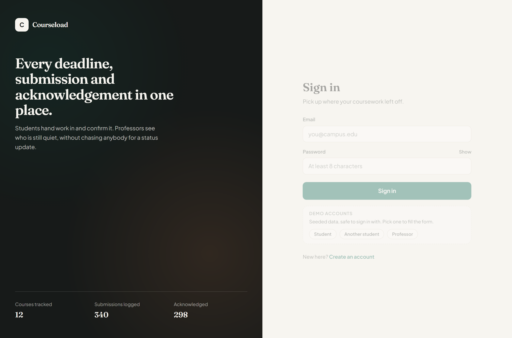 | 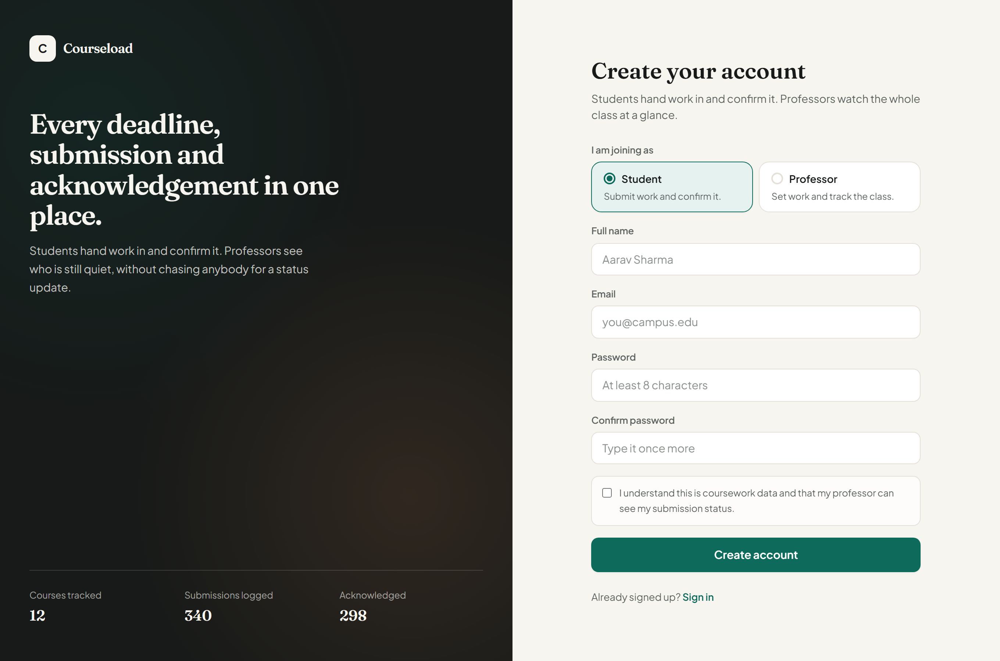 |

**Student**

| Dashboard | Course page |
| --- | --- |
| 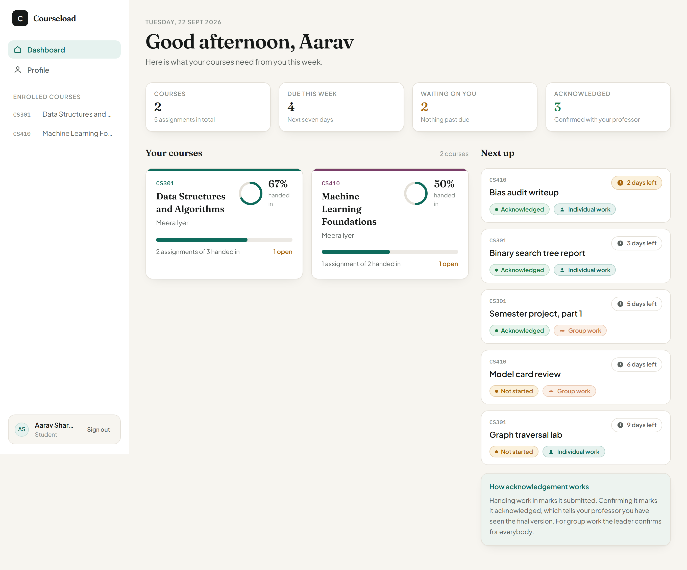 | 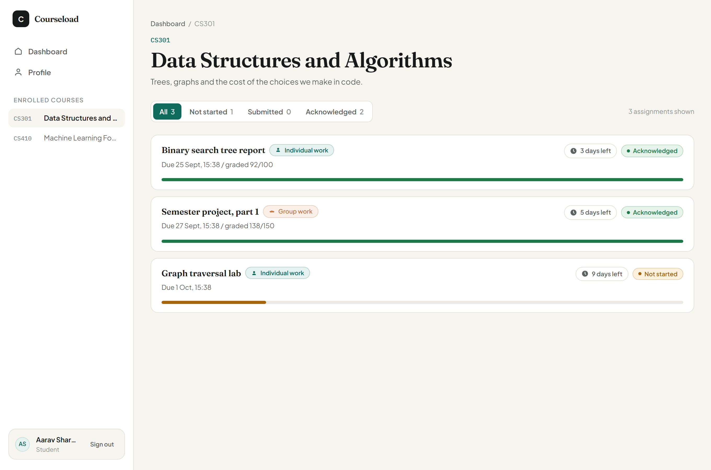 |

| Group assignment (leader view) | Assignment with nothing handed in |
| --- | --- |
| 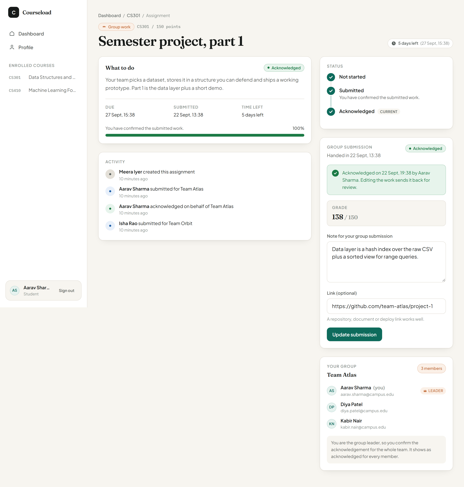 | 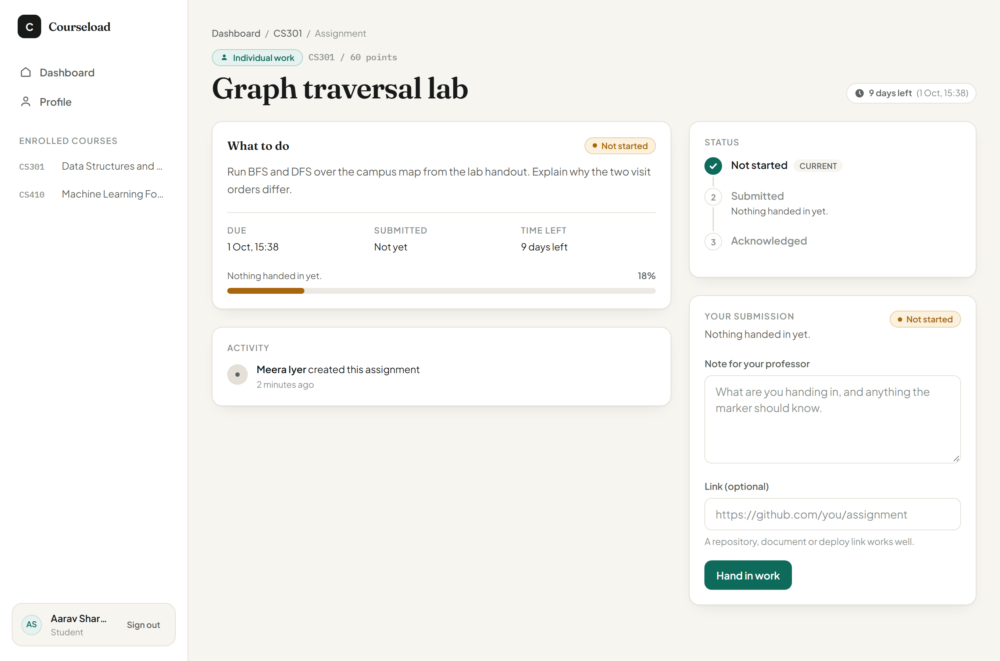 |

The leader screenshot above shows the acknowledge button. The same page for a group member (see [the acknowledgement rule](#the-acknowledgement-rule)) hides that button and explains who can confirm instead.

**Professor**

| Dashboard | Roster |
| --- | --- |
| 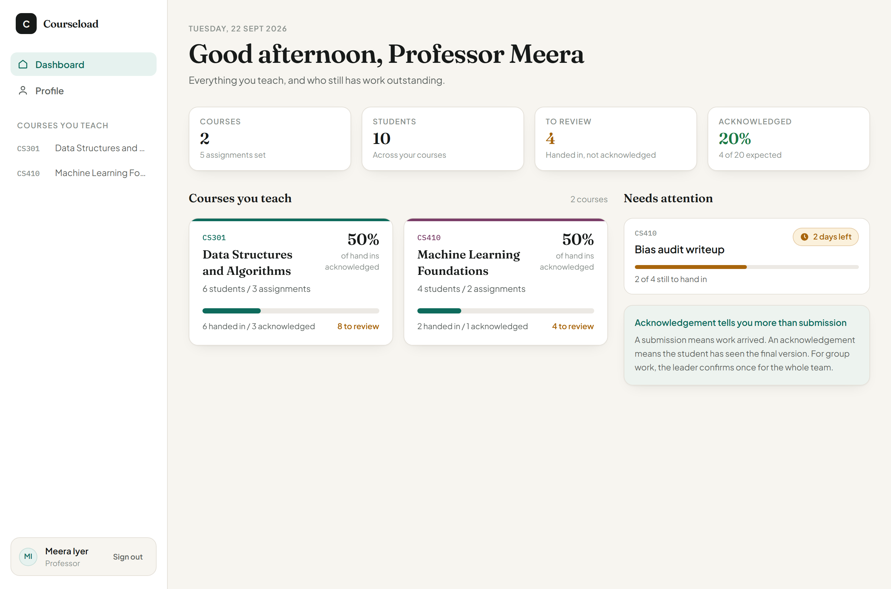 | 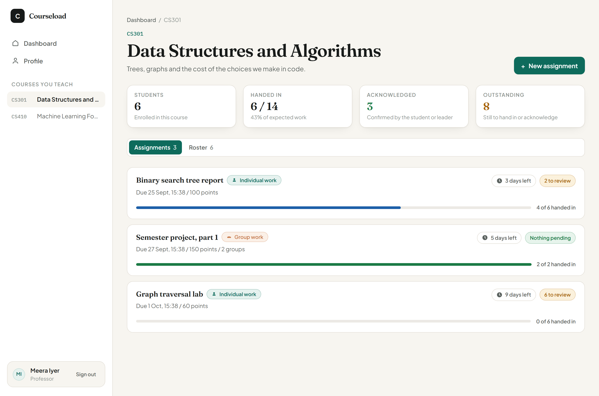 |

| Group submissions table | Individual submissions table |
| --- | --- |
| 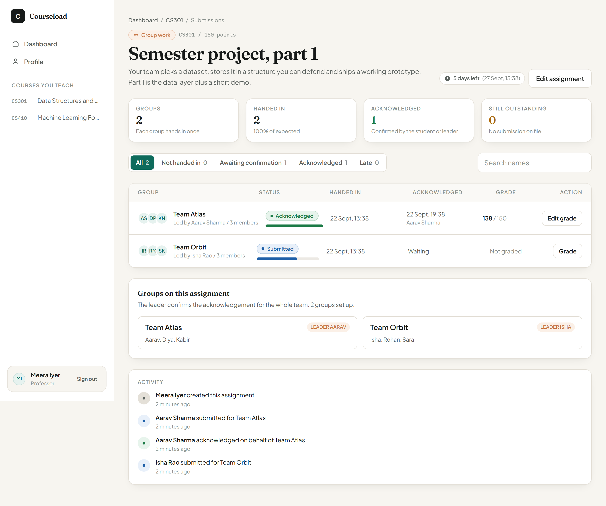 | 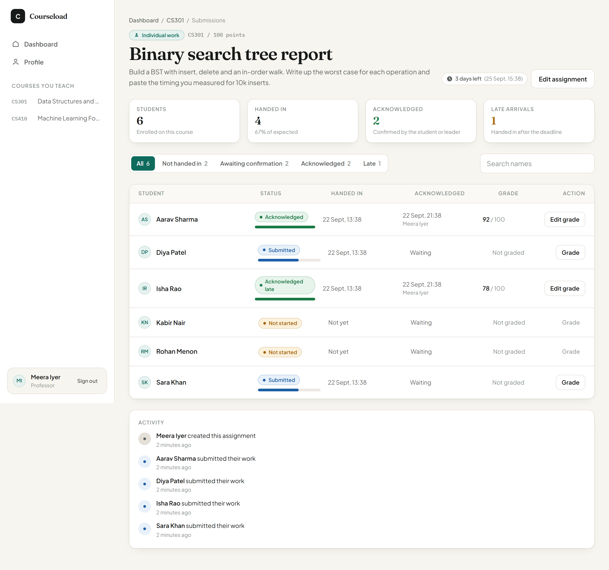 |

| Set an assignment with the group builder |
| --- |
| 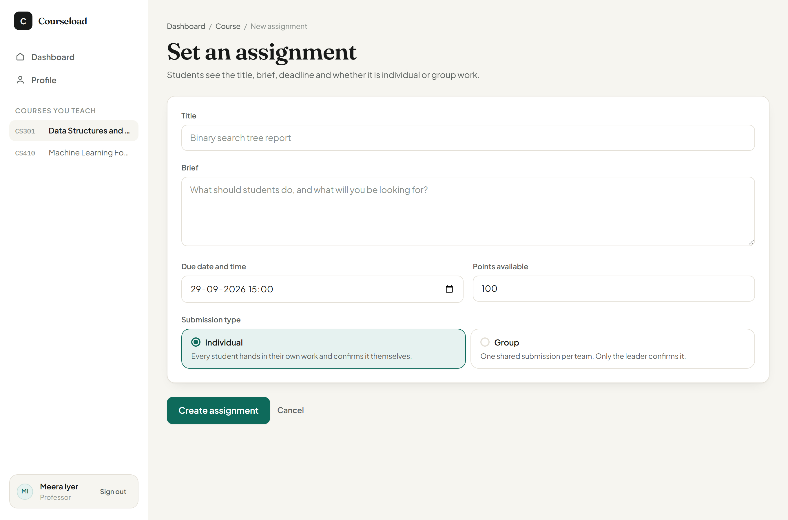 |

**Phone**

| Student dashboard | Group assignment |
| --- | --- |
| 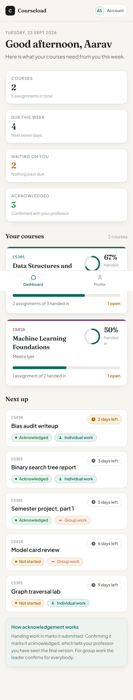 | 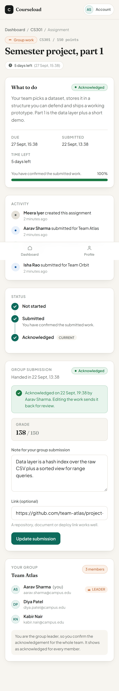 |

---

## Design choices and why

### Colour

The palette is grounded in university paperwork, with Lightswind's Amethyst theme as the primary, rather than the warm cream plus terracotta combination that has become the default look of generated dashboards.

| Token | Value | Used for |
| --- | --- | --- |
| paper | `#F2F1F5` | App background (cool porcelain) |
| surface | `#FFFFFF` | Cards, inputs, dialogs |
| ink | `#1B1927` | Body text (violet ink) |
| ink-soft | `#57536B` | Secondary text |
| line | `#E2DFEC` | Borders and dividers |
| primary | `#8B5CF6` | Buttons, links, focus ring (amethyst) |
| accent | `#C13B62` | Group work and leader marks (registry crimson) |
| pending | `#8A5A10` on `#F9F0DC` | Waiting on the student |
| submitted | `#1D5FA8` on `#E8F0FA` | Handed in |
| acknowledged | `#1B7A45` on `#E7F4EC` | Confirmed |
| overdue | `#A62B2B` on `#FBEAEA` | Past the deadline |

Reasons:

- Cool porcelain and violet ink read like exam papers and course registers, the subject's own materials, while the amethyst primary keeps the interface current.
- Amethyst gives a clear single action colour, and the crimson is spent only on group work marks and warnings, so nothing competes with the status colours.
- Every status is a dark ink on a pale tint of itself, which holds up against WCAG AA body text contrast instead of the usual pale pill on white.
- Courses carry their own accent (blue, ochre, plum, moss, violet) as a margin tab on the card edge, like a register's thumb tabs, so a grid of six courses is still scannable.

### The registry rule

One signature element carries the identity: the thick-thin double rule printed across exam papers and registers. It sits above every page header and on the sign-in panel, and nowhere else. Spending the boldness in one place keeps everything around it quiet.

### Type

- **Newsreader** for headings and numbers. An editorial serif with real text optical sizing, it reads as course material rather than app furniture.
- **Plus Jakarta Sans** for the interface. Open apertures and a tall x-height keep 13 to 15px labels legible.
- **IBM Plex Mono** for course codes, timestamps and counts, because those are data and should look like data.

Scale: display 40/30px, h1 30px, h2 22px, h3 17px, body 15/1.6, small 13px, labels 11.5px uppercase with 0.08em tracking. Line length is capped at 68 characters so the brief paragraphs stay readable.

### Layout and motion

- Container capped at 1180px, 4px spacing base, cards on a 1 / 2 / 3 column grid depending on width.
- Radius 8px for inputs, 12px for cards, pills for statuses. One shadow token, used only to lift a card off the paper.
- Motion follows a few strict rules: transitions name exact properties (never `all`), buttons answer a press with a 150ms scale(0.98), cards fade up in a 40ms stagger, progress bars fill over 400ms, checkmarks pop when they arrive, and everything is wrapped in `prefers-reduced-motion` so the page sits still when asked.
- Mobile under 1024px gets a top bar, a bottom tab bar, and the same content stacked. Nothing is hidden behind a hamburger that matters.

### Copy

The interface talks like a person marking work, not like a system reporting state.

- "Not started", "Handed in", "Waiting on you", "Nothing on the horizon".
- Errors say what happened and what to do: "That email is already registered. Try signing in instead." Never "Invalid input".
- Empty states explain the situation: "No courses yet. Your professor adds you to a course."
- Rule I held myself to: no em dashes anywhere in the UI, the docs, the comments or the commit messages.

### The acknowledgement rule

Handing work in and confirming it are different things, and the interface treats them differently on purpose.

- **Submitted** means the work arrived.
- **Acknowledged** means the student has seen the final version and is standing behind it.
- For an **individual** assignment the student acknowledges their own work.
- For a **group** assignment there is one shared submission. Any member can hand it in (so a team is never blocked waiting for one person to be online), and only the leader can acknowledge. The moment the leader acknowledges, `submissions.acknowledged_at` is set on the single shared row, and because every member reads the group row rather than their own, all of them see acknowledged. No fan out writes, no member rows to keep in step.

Editing a submission after acknowledgement sends it back to submitted, and that shows up in the activity feed. Silently keeping an acknowledgement on changed work would make the status meaningless.

---

## Architecture

```
Browser (React 19 + Tailwind)
   |
   |  fetch with Authorization: Bearer <jwt>
   v
Express API  ──  middleware: helmet, cors, json, rate limit, validate (zod), auth, error handler
   |
   |  pg Pool (max 3 in production)
   v
PostgreSQL 16
```

- The frontend never talks to the database. Every rule that matters (who can see a course, who can acknowledge, what counts as late) is enforced on the server, and the client only decides what to render.
- In development the browser calls `/api` on the Vite server, which proxies to the API, so the browser stays on one origin and CORS never enters the picture.
- In production the frontend is a static build on Vercel and the API is a serverless function on Vercel.

```
assignment-portal/
  package.json            npm workspaces, plus dev / db / test / screenshots scripts
  docker-compose.yml      Postgres 16 for local work
  scripts/                screenshot and smoke test runner
  docs/screenshots/       images used above
  backend/
    api/index.ts          Vercel serverless entry
    src/app.ts            express app wiring
    src/server.ts         local http server
    src/config/env.ts     zod validated environment
    src/db/               pool, schema.sql, migrate, seed
    src/lib/              errors, jwt, async handler
    src/middleware/       auth, validate, error
    src/modules/          auth, courses, assignments, groups, submissions, dashboard
    tests/                vitest + supertest, 39 tests
  frontend/
    src/api/              fetch client, endpoint wrappers, shared types
    src/context/          auth session, toasts
    src/hooks/            useAsync, useCountdown
    src/layouts/          AuthLayout, AppLayout (sidebar, top bar, bottom tabs)
    src/components/ui/    the design system primitives
    src/components/app/   course cards, assignment rows, submission panel, group panel, feed
    src/pages/            eleven screens plus 404
    src/lib/              formatting, status mapping, validation, class names
    src/tests/            20 tests for the pure logic
```

---

## Database

Eight tables. Students and professors share one `users` table with a role column, because the only difference between them is what they are allowed to read and write, and one table keeps every join simple.

| Table | Key columns | Notes |
| --- | --- | --- |
| `users` | id, name, email (unique), password_hash, role | role is the `user_role` enum: student or professor |
| `courses` | id, code (unique), title, description, professor_id, accent | accent drives the card colour |
| `enrollments` | course_id, student_id, unique together | a real table, not an array, so it can be indexed and joined |
| `assignments` | id, course_id, title, description, due_at, submission_type, max_points, created_by | submission_type is individual or group |
| `groups` | id, assignment_id, name, leader_id, unique (assignment_id, name) | leader_id is the single source of truth for who can acknowledge |
| `group_members` | group_id, student_id, unique together | membership, one row per person |
| `submissions` | assignment_id, student_id, group_id, content, link_url, status, is_late, submitted_at, acknowledged_at, acknowledged_by, grade, feedback | one row per student, or one shared row per group |
| `activities` | actor_id, assignment_id, submission_id, action, summary | powers the assignment activity feed |

Relationships and the rules that keep them honest:

- `courses.professor_id` references `users`, so a professor only ever sees courses they own.
- `assignments.course_id` references `courses`, and deletion cascades, so removing a course removes its work and submissions with it.
- `groups.leader_id` references `users`, and the service layer refuses a group whose leader is not one of its members.
- `submissions` carries a check constraint: either `student_id` is set and `group_id` is null, or the other way round. A row can never be half individual and half group.
- Two partial unique indexes (`submissions_individual_key`, `submissions_group_key`) make "one submission per student" and "one per group" real database rules rather than something the code hopes for.
- `student_id` and `group_id` both cascade on delete, so a removed group does not leave orphaned submissions behind.

`npm run db:migrate` runs an idempotent `schema.sql`, which is what makes the deploy to a fresh database one command.

---

## API

All routes are JSON. Everything except `/api/health`, `/api/auth/register` and `/api/auth/login` needs a bearer token.

| Method | Route | Who | Purpose |
| --- | --- | --- | --- |
| GET | `/api/health` | anyone | Liveness check |
| POST | `/api/auth/register` | anyone | Create a student or professor account, returns a token |
| POST | `/api/auth/login` | anyone | Sign in, returns a token and the role for redirection |
| GET | `/api/auth/me` | signed in | Who the token belongs to |
| GET | `/api/dashboard` | signed in | Role aware numbers, course cards and what needs attention |
| GET | `/api/courses` | signed in | Student: enrolled courses. Professor: courses they teach |
| POST | `/api/courses` | professor | Create a course, optionally enrolling students |
| GET | `/api/courses/:id` | enrolled or owner | Student gets their assignment list, professor gets the roster |
| GET | `/api/courses/:id/assignments` | professor | Assignment list with tallies |
| POST | `/api/courses/:id/assignments` | professor | Create an assignment, with groups when the type is group |
| GET | `/api/assignments/:id` | enrolled or owner | Role aware detail: submission, group, activity, or the table |
| PATCH | `/api/assignments/:id` | professor | Edit title, brief, deadline, type, points, groups |
| DELETE | `/api/assignments/:id` | professor | Remove an assignment |
| GET | `/api/assignments/:id/submissions` | professor | Submission table with `?status=` and `?q=` |
| GET | `/api/assignments/:id/groups` | enrolled or owner | Groups with members and the leader |
| POST | `/api/assignments/:id/groups` | professor | Add a group after the fact |
| POST | `/api/assignments/:id/submissions` | student | Hand work in, or update it. Sets `is_late` when past the deadline |
| POST | `/api/submissions/:id/acknowledge` | student | Confirm. 403 unless it is yours, or your group's and you are the leader |
| PATCH | `/api/submissions/:id/grade` | professor | Grade and leave feedback |
| PATCH | `/api/groups/:id/leader` | professor | Move the leader to another member |
| DELETE | `/api/groups/:id` | professor | Remove a group |

Errors come back as one shape so the frontend has one thing to handle:

```json
{ "error": { "message": "Only the group leader can acknowledge for the team.", "code": "forbidden", "details": {} } }
```

Invalid input adds per field messages in `details`, which the forms map straight onto the inputs.

---

## Authentication model

- Passwords are hashed with `bcryptjs` at cost 10. Pure JavaScript on purpose: it avoids native build tooling, which is a real problem on Node 25 and Windows.
- Tokens are HS256 JWTs, 7 day expiry, with the role and name in the payload so the client can route and greet without a second request. The server still re-reads the user on `/api/auth/me`.
- Login answers the same way for a wrong password and an unknown email, and always performs one bcrypt comparison, so response timing does not reveal which emails are registered.
- Registration and login are rate limited to 40 attempts per 15 minutes per address.
- The token is kept in `localStorage` and sent as `Authorization: Bearer`. The trade off: an httpOnly cookie is safer against script injection, but the deployed frontend and API live on different hosts, which would need `SameSite=None; Secure` plus exact origin CORS and credentials on every request. For a coursework submission the header is fewer moving parts across two hosts.

Role rules are enforced server side, not just hidden in the UI:

- Students only reach courses they are enrolled in.
- Professors only reach courses they own.
- An id that is not a UUID answers 404 rather than throwing a database error.

---

## Run it locally

Requirements: Node 20 or newer, and Docker Desktop for the database. (Any PostgreSQL 14+ server works too, change `DATABASE_URL` and skip the compose step.)

```bash
# 1. dependencies for both workspaces
npm install

# 2. start PostgreSQL 16 (creates the portal database and a portal_test database)
npm run db:up

# 3. environment files
cp backend/.env.example backend/.env
cp backend/.env.test.example backend/.env.test

# 4. schema and demo data
npm run db:setup

# 5. run the API on :4000 and the frontend on :5173 together
npm run dev
```

Then open http://localhost:5173.

### Demo accounts

The seed creates two professors, eight students, three courses, seven assignments (individual and group), five groups and submissions spread across pending, submitted, late and acknowledged, so every screen has something real to show.

| Role | Email | Password | Worth seeing |
| --- | --- | --- | --- |
| Professor | meera.iyer@campus.edu | professor123 | Owns CS301 and CS410 |
| Professor | arun.verma@campus.edu | professor123 | Owns CS220, proves course isolation |
| Student | aarav.sharma@campus.edu | student123 | Leader of Team Atlas, has a grade |
| Student | isha.rao@campus.edu | student123 | Leader of Team Orbit, can acknowledge |
| Student | kabir.nair@campus.edu | student123 | Group member, cannot acknowledge |

`npm run db:seed` can be run again at any time. It truncates and rebuilds the demo data.

### Environment variables

`backend/.env`

| Variable | Purpose |
| --- | --- |
| `PORT` | API port, 4000 by default |
| `DATABASE_URL` | PostgreSQL connection string |
| `JWT_SECRET` | At least 16 characters. Changing it signs everybody out |
| `JWT_EXPIRES_IN` | Token lifetime, `7d` by default |
| `CLIENT_ORIGIN` | Comma separated list of allowed browser origins |
| `AUTH_RATE_LIMIT` | Sign in attempts per address per 15 minutes, 40 by default. Raise it for a demo run, keep it low in production |

`frontend/.env`

| Variable | Purpose |
| --- | --- |
| `VITE_API_URL` | API origin for a deployed frontend. Leave empty locally, Vite proxies `/api` |

The test database guard lives in `backend/tests/setup.ts`: the suite refuses to run unless `DATABASE_URL` points at a database whose name contains `test`, so a careless `npm test` can never truncate the seeded development data.

---

## Tests

```bash
npm test                 # both suites
npm --workspace backend run test
npm --workspace frontend run test
npm run typecheck        # tsc --noEmit in both workspaces
npm run verify           # typecheck, then tests
```

**Backend: 39 tests, Vitest + Supertest against a throwaway database.** Every test truncates first, so order never matters.

- Auth: register, duplicate email, field level validation, identical answers for a wrong password and an unknown email, `/me` with and without a token.
- Courses: professor only creation, a student sees only their enrolments, no access to a course you are not enrolled in, no access to another professor's course, roster counts, malformed ids.
- Assignments: group creation with a leader, a leader who is not a member is rejected, a group member who is not enrolled is rejected, due date validation, edit by the owner only, groups locked once somebody has submitted, status filter counts, name search, students blocked from the table.
- Regression tests for the count bug found during manual testing: a student in two different groups on two assignments is counted once per assignment, and a group submission counts once rather than once per member.
- Submissions: hand in, note or link required, late flag, non enrolled student blocked, group submission from somebody with no group blocked, one submission shared across the team, a non leader cannot acknowledge, the leader can and every member then reads acknowledged, one student cannot acknowledge another's work, editing after acknowledgement resets it, grading respects the point limit.
- Dashboards: student workload counts, deadlines in order, professor students, to review, acknowledgement rate and what needs attention.

**Frontend: 20 tests, Vitest.** They cover the logic that decides what a user is told: email, name, password and link validation, password strength, status labels and tones (including late and overdue wording), accent fallbacks, timeline steps, deadline countdowns, relative times, initials and percentages.

**Manual pass and end to end smoke test.** `npm run screenshots` drives a real Chromium through fourteen screens, which fails loudly if a page stops rendering. That run also confirmed:

- Sign in with the wrong details shows one clear message, not a stack trace.
- Role based redirect lands a student on `/student` and a professor on `/professor`.
- A leader can hand work in and acknowledge it; the acknowledgement appears in the activity feed and on the professor table with the leader's name against it.
- A group member sees the same acknowledged state, has no acknowledge button, and is told who confirmed it.
- Grading from the submissions table writes the grade, the feedback and an activity entry.
- Creating a group assignment with teams and leaders from the form works, and the new assignment opens with the right tallies.
- No horizontal overflow at 375px on the dashboard, the assignment page or the submissions table.

---

## Screenshots script

```bash
# with both servers running
npm run screenshots
```

The script signs in through the API, finds the interesting rows by title, then visits every page and writes full page images into `docs/screenshots`. Change `WEB_URL` or `API_URL` to point at a deployed environment.

One caveat: sign ins are rate limited, so running it repeatedly in a short window will trip the limit and the script will say so. Restart the API to clear the in memory counter, or raise `AUTH_RATE_LIMIT` for the run.

---

## Deployment

The whole stack runs on Vercel plus a managed PostgreSQL. Total set up time is about ten minutes.

### 1. Database (Neon free tier)

1. Create a project at [neon.tech](https://neon.tech) and copy the **pooled** connection string (it contains `-pooler`).
2. Put it in `backend/.env` locally as `DATABASE_URL`, then push the schema and demo data:

```bash
cd backend && npm run db:migrate && npm run db:seed
```

Neon requires TLS, which `src/db/pool.ts` turns on automatically for a Neon or Render hostname.

### 2. API (Vercel)

1. Import the repository, set **Root Directory** to `backend`.
2. Environment variables: `DATABASE_URL`, `JWT_SECRET` (long and random), `JWT_EXPIRES_IN=7d`, `CLIENT_ORIGIN=https://your-frontend.vercel.app`, `NODE_ENV=production`.
3. Deploy. `backend/vercel.json` sends every request to `api/index.ts`, which is the Express app as a single serverless function.
4. Check `https://your-api.vercel.app/api/health` answers `{"status":"ok"}`.

The pool is capped at three connections in production, which suits a serverless function talking to a pooled Neon endpoint.

### 3. Frontend (Vercel)

1. Import the same repository again, set **Root Directory** to `frontend`.
2. Environment variable: `VITE_API_URL=https://your-api.vercel.app`.
3. Deploy. `frontend/vercel.json` rewrites unknown paths to `index.html` so client side routes work on a refresh.

If you change the frontend URL, update `CLIENT_ORIGIN` on the API and redeploy. Preview deployment URLs are already allowed by the CORS check.

### Fallback: API on Render

If you would rather run a long lived server than a function, `backend` runs unchanged with `npm run build && npm start` on a Render web service. Point `DATABASE_URL` at the same Neon database. The only reason Vercel is the primary path is that the brief asks for a deployed frontend on Vercel or Netlify, and keeping both halves in one place is fewer dashboards to visit.

---

## How the brief maps to the code

| Brief item | Where it lives | Evidence |
| --- | --- | --- |
| 1.1 Auth flow, validation, feedback, role based redirect | `pages/auth/*`, `AuthContext`, `modules/auth` | Login shows inline field errors, a spinner, and one clear message. Redirect happens on the returned role. 7 auth tests |
| 1.2 Student dashboard of enrolled courses, clickable into assignments | `pages/student/Dashboard.tsx`, `components/app/CourseCard.tsx` | Course cards link to the course, then to the assignment |
| 1.2 Professor dashboard with analytics and student counts | `pages/professor/Dashboard.tsx` | Acknowledgement rate, to review, what needs attention |
| 1.2 Responsive grid | `tailwind.config.ts`, page layouts | 1 / 2 / 3 column grids, checked at 375px and 1360px |
| 1.3 Assignment details, deadline, submission type | `pages/student/AssignmentDetail.tsx` | Title, brief, due date, live countdown, type badge, points |
| 1.3 Submission status, progress bars, acknowledgement, animation | `components/ui/Progress.tsx`, `StatusTimeline.tsx` | Progress bar and ring, three step timeline, pop on checkmark, staggered card entry |
| 1.3 Only the group leader acknowledges, reflected for all members | `modules/submissions/service.ts`, `POST /api/submissions/:id/acknowledge` | Non leader gets 403 with a plain explanation. Members read the shared group row. 3 tests |
| 1.4 Progress bars, badges, checkmarks, clear communication | `StatusPill`, `ProgressBar`, `ProgressRing`, `StatusTimeline` | Same vocabulary on student and professor screens |
| 2.1 students, professors, courses, assignments, groups collections | `src/db/schema.sql` | Eight tables including `groups` and `group_members`, documented above |
| 2.1 Professors can see submission status and student count | Professor dashboard and roster | Per student handed in and acknowledged counts |
| 2.2 Relationships through references | Foreign keys with cascades, plus the `submissions` owner check constraint | See the database section |
| 2.2 Group membership logic and its impact on submissions | `modules/groups`, `loadStudentGroup` | Group submissions are stored on the group, not per student |
| 2.2 Acknowledgements tracked for individual and group work | `submissions.acknowledged_at`, `acknowledged_by` | Shown on the student page and in the professor table |
| 3.1 JWT for both roles, correct response and redirection per role | `lib/jwt.ts`, `POST /api/auth/login` | Login returns the role, the client routes on it |
| 3.2 Professor create, edit and view assignments | `pages/professor/AssignmentForm.tsx`, `modules/assignments` | One form for create and edit, owner checked on the server |
| 3.2 Monitor submissions, track who submitted or acknowledged | Professor assignment table | Status, submitted time, who acknowledged, grade |
| 3.2 Filter submissions by status | `?status=all\|pending\|submitted\|acknowledged\|late` | Tabs with counts, plus name search |
| 3.3 Submit and acknowledge, individual and group, with validation | `modules/submissions`, `SubmissionPanel` | Note or link required, group membership required, late flag |
| 4.1 Repository with a clear commit history, separate folders | `backend/` and `frontend/` | Conventional commits, one per unit of progress |
| 4.2 Deployed frontend connected to the backend | Vercel, both halves | Deployment steps above |
| 4.3 README: design rationale, setup, screenshots, component structure | This file | Fourteen screenshots, component tree below |
| 4.4 Demo video | Script in the last section | |
| 5 React + Tailwind, Node + Express + PostgreSQL, JWT, CRUD, groups, deploy | Whole stack | `npm run verify` is green |

---

## Trade-offs and next steps

Things I decided against, and what I would do with more time.

1. **No component library.** Every control is built from Tailwind and the design tokens. It cost more lines than pulling in a kit, and it is the difference between a screen that looks like this project and a screen that looks like every other project. A kit would also have needed a theme layer to undress before it could look like anything.
2. **Bearer token rather than an httpOnly cookie.** Explained above. On a single origin I would switch to cookies with `SameSite=Lax` and drop `localStorage` entirely.
3. **Any member can submit, only the leader acknowledges.** The brief pins down acknowledging and says nothing about submitting. Locking submission to the leader would leave a team stuck whenever the leader is away, so I allowed it and wrote the rule into the UI and this README.
4. **Tallies are computed in SQL and aggregated in JavaScript.** One query returns the student, assignment and status matrix, and the counts are rolled up in code. That keeps every "handed in" number on every screen derived from exactly the same source, at the cost of some memory per request. At a few thousand rows I would move the aggregation into a SQL view.
5. **No pagination on the submission table.** A course with 300 students would need it. The endpoint already takes filters, so adding `limit` and `offset` is contained work.
6. **No file uploads.** Submission takes a note and a link. Real uploads need object storage, signed URLs and virus scanning, which is a project on its own. The `submissions` row already has room for a storage key.
7. **No email or reminders.** The professor sees who is quiet, but nothing notifies anybody.
8. **Next, in order:** pagination on the submission table, a cohort wide view for a professor teaching several courses, per assignment statistics on the course page (score distribution, late rate), and CSV export of a submission table so a mark can leave the app.

---

## Component structure

```
App (routes)
├── AuthLayout
│   ├── LoginPage          form, demo account chips, spinner, error banner
│   └── RegisterPage       role segmented control, strength meter, terms
└── AppLayout              sidebar (desktop), top bar and bottom tabs (mobile)
    ├── PageHeader         breadcrumbs, eyebrow, display title, actions
    ├── StudentDashboard   StatTile x4, StudentCourseCard grid, upcoming list
    ├── StudentCourseDetail  Tabs by status, StudentAssignmentRow list
    ├── StudentAssignmentDetail
    │   ├── StatusTimeline      not started, submitted, acknowledged
    │   ├── SubmissionPanel     note, link, hand in, acknowledge, rules for members
    │   ├── GroupPanel          members, leader mark, who confirms
    │   └── ActivityFeed        who did what, when
    ├── ProfessorDashboard  StatTile x4, ProfessorCourseCard grid, needs attention
    ├── ProfessorCourseDetail  Tabs: assignments or roster
    ├── AssignmentForm      fields, type choice, GroupRow builder
    ├── ProfessorAssignmentDetail
    │   ├── Tabs + search       status filters with counts
    │   ├── submission table    per student or per group
    │   ├── GradeDialog         reads the work, sets grade and feedback
    │   └── groups card         teams and leaders at a glance
    ├── ProfilePage
    └── NotFoundPage
```

Shared primitives in `components/ui`: Button, Field (TextField, TextAreaField, SelectField), Badge (StatusPill, TypeBadge), Card (CardHeader, StatTile), Modal, ConfirmDialog, Tabs, SegmentedControl, ProgressBar, ProgressRing, StatusTimeline, CountdownChip, Avatar, AvatarGroup, Alert, EmptyState, ErrorState, Skeleton, Spinner.

---

## Demo video script

Roughly six minutes, recorded in this order. Log in as the professor for the odd numbered steps and as the student for the even ones.

1. **Sign in as a student** (`aarav.sharma@campus.edu`). Point out the greeting, the four numbers, the course cards with their progress rings, and the acknowledgement explainer.
2. **Open an individual assignment** with nothing handed in ("Graph traversal lab"). Type a note, hand it in, watch the status move to submitted and the activity feed record it. Acknowledge it, and show the timeline reach the end.
3. **Open the group assignment** ("Semester project, part 1"). Show the shared submission, the group panel with the leader marked, and the note explaining who can acknowledge.
4. **Sign in as a group member** (`kabir.nair@campus.edu`). Same page: the acknowledge button is gone and the page says who confirms instead. Then sign in as the leader (`isha.rao@campus.edu`) and acknowledge, and show the member view flips to acknowledged.
5. **The database.** In a terminal: `docker compose exec db psql -U portal -d portal`, then `\dt` to list the eight tables, and a select of `submissions` joined to `groups` to show one shared row per team.
6. **Sign in as the professor.** Show the dashboard numbers, then open an assignment and walk the submission table: filter to awaiting confirmation, search a name, open the grade dialog on a hand in, save a grade, and show the activity feed pick it up.
7. **Create an assignment.** Set the type to group, add a team, pick a leader, save, and show the new assignment open with its tallies.
8. **Close on the profile page and the mobile view**, and mention the two commands that bring the whole thing up: `npm run db:up` and `npm run dev`.
# Courseload


